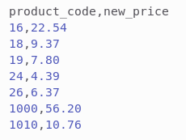
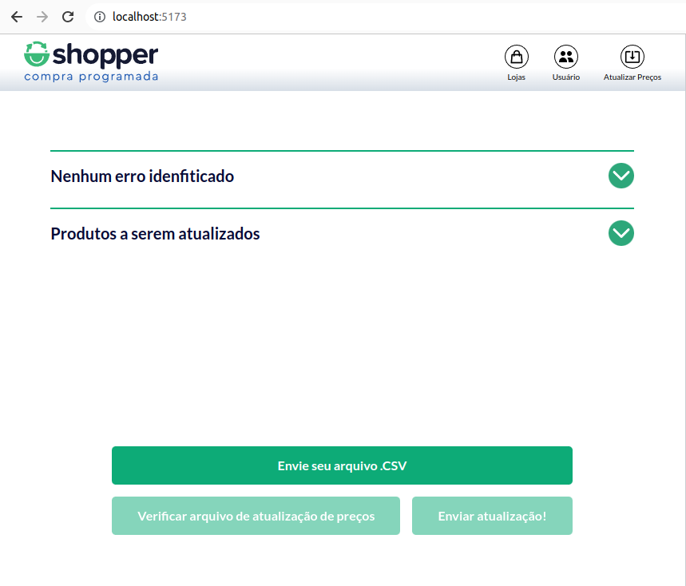
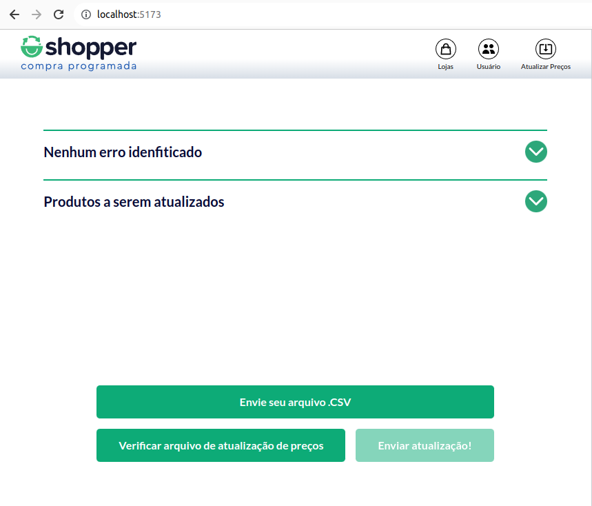
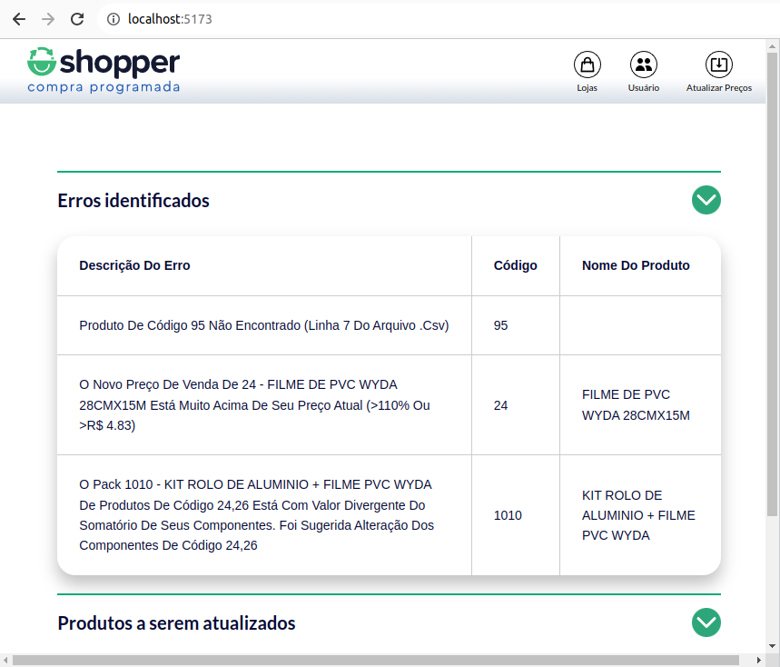
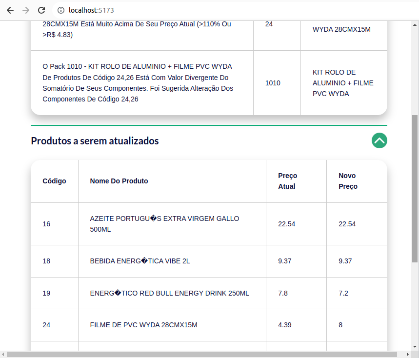
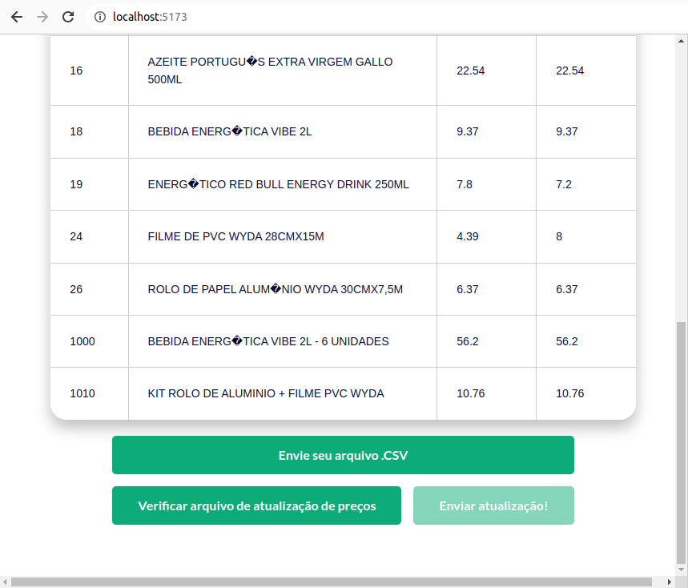
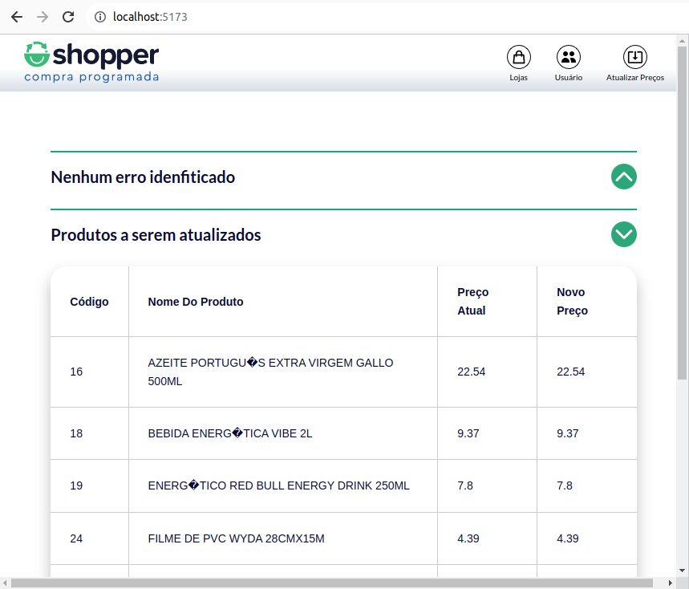
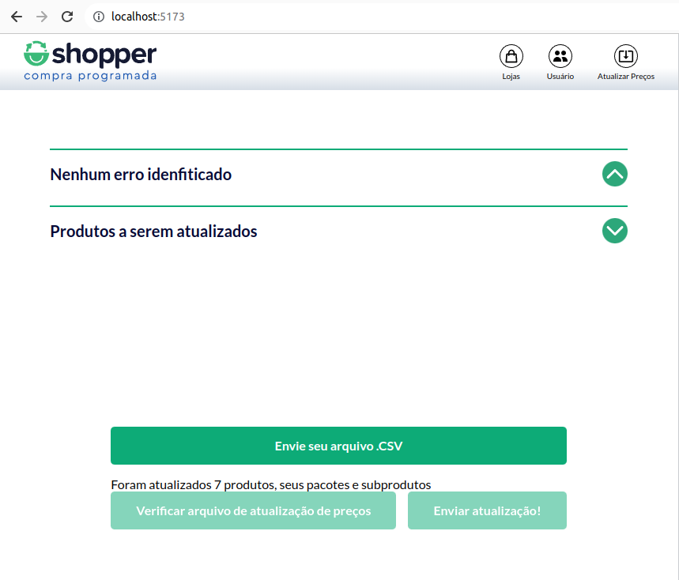

# ShopperTest_FE

### Front End para teste técnico FullStack JR - Empresa Shopper

#### [inspiração de layout e cores do site da Shopper](https://landing.shopper.com.br/)

## Apresentação

- Projeto desenvolvido com:
  - React v18.2.0;
  - Vite 4.1.0;
  - Styled Components;
  - Hooks React;
  - Integração com API [pedromsra/ShopperTest](https://github.com/pedromsra/ShopperTest) desenvolvida em NodeJS (documentação disponível);

- Principais funcionalidades:
  - Upload de arquivo .csv;
  - Exibição de relatório de erros, se existir;
    - Relatório no formato: erro > codigo do produto > nome do produto;
  - Exibição de produtos a serem atualizados, se existir;
    - Relatório no formato: codigo do produto > nome do produto > preço atual > novo preço;
  - Envio de lista de produtos para atualizar no banco de dados;

### Clonar repositório do github

[Diretório Github: teste Shopper FrontEnd](https://github.com/pedromsra/ShopperTest_FE)

### Iniciando a aplicação

- Abrir terminal e digitar:
  - `$ cd /local_da_pasta_onde_a_FE_está_salva`;
  - `$ npm install`;
  - `$ npm run dev`

> Atenção à porta utilizada no backend, por padrão o frontend está se conectando à API pelo localhost:3010, se a porta for alterada no backend, alterar no arquivo /src/services/api.js, na linha: `baseURL: "http://localhost:NOVAPORTA"`

## Imagens de funcionamento

### Exemplo de conteúdo esperado no arquivo .csv

### Pagina para enviar arquivo .csv

### Arquivo enviado

- Botaão de verificação passa a ficar habilitado

### Apertar botao Verificar

#### Caso 1: Presença de erros

- Automaticamente abre a aba de relatório de erros

- Pode-se também verificar os produtos para atualizar presentes no arquivo .csv

- Caso existam erros o botão de enviar atualizações de preços fica desabilitado

#### Caso 2: Ausencia de erros

- Automaticamente abre a aba de relatório de produtos e a aba de relatório de erros deve constar: 'Nenhum erro encontrado'

- Com a ausência de erros o botão enviar passa a fica habilitado

### Apertar botão Enviar

- Limpa os relatório e fica habilitado o envio de um novo relatório (Para enviar o mesmo relatório é preciso reiniciar a página)

